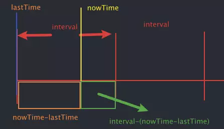

# handwritten

用于个人学习手写实现一些代码

## 自动柯里化函数

1、接收一个函数，返回一个柯里化函数

2、判断当前接收的总的参数个数，是否大于等于需要的函数参数

- 满足要求就执行该函数

- 不满足要求，在返回一个新的函数，用来继续接收参数

3、新的函数接收到参数后，合并参数并递归调用来检查函数是否达到要求

## 防抖的实现

实现防抖的基本功能：

> 利用 setTimeout 来延迟函数的执行，通过取消之前的定时器，并重新设置 setTimeout 来实现不断触发推迟函数执行。

优化一：优化参数和 this 指向

> 利用显示绑定和剩余参数实现

优化二：增加取消功能

> 添加 cancel 函数，取消定时器，重置数据

优化三：优化立即执行效果（第一次立即执行）

优化四：优化返回值（回调函数 和 Promise）

## 节流的实现

v1- 基本实现

原理如图所示：

通过判断 interval - (nowTime - lastTime) < = 0 得到的结果来得出是否触发事件

v2- this 参数

通过显示绑定 apply 来改变 this 的绑定

v3- 头部立即执行

因为第一次的 nowTime 的值非常的大，而一开始 lastTime 的值为 0，所以相减后得到的值是负数，所以会立即执行，后面 lastTime 的值是触发后的 nowTime，所以正常触发。

所以，需要立即执行，默认不改变

不需要立即执行，因为只需要第一次就好，所以判断 lastTime = 0 则表示第一次
